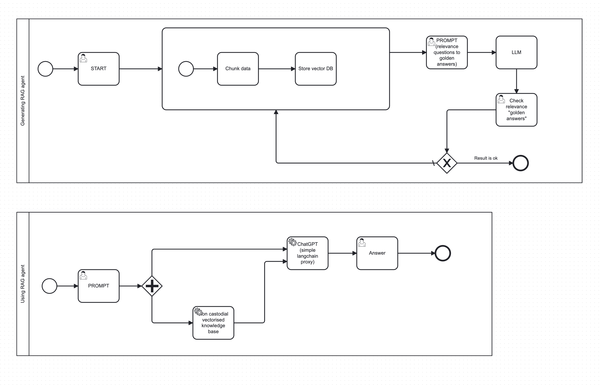

### Problem Statement
Many users and companies are unsatisfied with general LLM models due to their lack of domain-specific knowledge and context. While Retrieval-Augmented Generation (RAG) technology helps to generate better answers by incorporating external context, building individual RAG pipelines is expensive and requires extensive documentation and context data. Additionally, companies may want to commercialize their knowledge data datasets but are reluctant to share their data directly due to privacy concerns.

### Overview
The GuruInsight Exchange (GIE) ecosystem leverages the power of non-custodial vectorized knowledge bases and advanced AI technologies, including Large Language Models (LLM) and Retrieval-Augmented Generation (RAG), to provide domain-specific, context-aware responses. The system allows knowledge owners to monetize their data securely while enabling users to benefit from accurate and relevant information.

### Components

#### Non-Custodial Vectorized Knowledge Bases
- Knowledge owners maintain control over their data by storing it in vectorized format using databases like ClickHouse.
- The data is chunked and stored in a vectorized format, enabling efficient retrieval based on relevance without exposing raw data.

#### Guru Network
- An ecosystem that connects users seeking information with knowledge owners.
- Facilitates the secure exchange of knowledge without centralizing data, preserving privacy and security.

#### Context Generation and Verification
- Data is periodically collected and processed to generate context.
- Human experts verify the relevance and accuracy of generated contexts (golden answers) to ensure high-quality responses.
- The system uses user prompts to continually update and improve the context database.

#### Retrieval-Augmented Generation (RAG)
- Combines retrieved contextual data with LLM capabilities to provide detailed and accurate responses.
- The RAG system queries the vectorized knowledge bases to augment user prompts with relevant context.

#### Large Language Model (LLM) Integration
- The LLM (e.g., GPT-based model) processes augmented prompts to generate insightful responses.
- The LLM is used as an external service, ensuring scalability and flexibility.

#### User Interaction Flow
- Users send prompts to the Guru Network.
- The system selects additional context by querying non-custodial knowledge bases.
- Augmented prompts are processed by the LLM to generate responses.
- Users receive accurate and context-aware answers.

### Process Workflow

#### Data Collection and Context Generation
- Data is continuously collected from various sources and chunked into vectorized format.
- The context is generated and stored in a vector database.
- A periodic process verifies and updates the context with human-verified golden answers.

#### User Prompt Handling
- Users submit prompts through the Guru Network interface.
- The system identifies relevant contexts by querying the vectorized knowledge bases.
- The context-enriched prompts are sent to the LLM for processing.

#### Response Generation and Feedback
- The LLM generates responses based on the augmented prompts.
- Users receive the responses, which are refined over time through feedback and further verification.

### Benefits
- **Privacy and Security**: Maintains data control for knowledge owners.
- **Enhanced Accuracy**: Provides highly relevant, domain-specific answers.
- **Scalability**: Easily scales with more knowledge owners and users without centralizing data.
- **Commercialization**: Allows knowledge owners to monetize their data effectively.

The GIE ecosystem combines cutting-edge AI with secure data practices to create a robust, scalable, and efficient platform for knowledge exchange.

### SWAT Analysis for the Guru Network Ecosystem Project: "Guru Insight Exchange (GIE)"

#### Strengths
1. **Privacy and Security**: GIE leverages the Guru Network's non-custodial vectorized knowledge bases, allowing companies to maintain control over their sensitive data without sharing it directly with external entities.
2. **Commercialization Opportunities**: Knowledge owners can monetize their data by offering access to their vectorized knowledge base for context augmentation without revealing the actual data, creating a new revenue stream.
3. **Enhanced Accuracy**: By adding domain-specific context to prompts, GIE significantly improves the accuracy and relevance of LLM responses, benefiting both users and knowledge base owners.
4. **Scalability**: The GIE model can scale by adding more knowledge owners and users without centralizing data, ensuring that the system remains robust and distributed.

#### Weaknesses
1. **Complexity of Integration**: Setting up non-custodial vectorized knowledge bases and ensuring seamless integration with the Guru Network might require significant technical expertise and resources.
2. **Performance Overhead**: Querying multiple knowledge bases for context and integrating the results could introduce latency, potentially impacting the response time.
3. **Dependence on Knowledge Owners**: The effectiveness of GIE heavily relies on the participation and quality of the knowledge bases provided by the owners. Limited participation or low-quality data could undermine the system's effectiveness.
4. **User Trust and Adoption**: Building trust among users to rely on GIE for context and ensuring adoption by knowledge base owners might be challenging.

#### Opportunities
1. **Market Expansion**: There is a growing demand for domain-specific AI solutions. GIE can tap into various industries like healthcare, finance, law, and technology where large knowledge bases exist.
2. **New Revenue Streams**: Companies can generate new revenue streams by commercializing access to their vectorized knowledge bases without compromising data security.
3. **Partnerships and Collaborations**: Forming strategic partnerships with leading companies in different domains can enhance the network's credibility and reach.
4. **Innovation and Differentiation**: GIE can position itself as an innovative solution within the Guru Network ecosystem, differentiating itself from traditional LLM services by offering enhanced, context-aware responses.

#### Threats
1. **Competition**: There are numerous AI and LLM-based services emerging. Competing with established players who might offer similar services could be challenging.
2. **Data Privacy Regulations**: Navigating complex data privacy regulations across different regions can pose a significant challenge. Any breaches or mishandling of data could lead to legal repercussions.
3. **Technical Challenges**: Ensuring the robustness, security, and efficiency of the non-custodial vectorized databases and the integration process can be technically challenging.
4. **User and Knowledge Owner Engagement**: Sustaining active engagement from both users and knowledge base owners over time is crucial for the system's success. A decline in participation from either side can threaten the viability of the network.

### Summary
"GuruInsight Exchange (GIE)" within the Guru Network ecosystem presents a promising solution for leveraging large, domain-specific knowledge bases without compromising data privacy. GIE offers significant strengths in privacy, commercialization, and accuracy enhancement, along with opportunities for market expansion and new revenue streams. However, it faces potential weaknesses in integration complexity, performance overhead, and reliance on knowledge owners. Additionally, GIE must navigate threats from competition, regulatory challenges, and the need for sustained engagement.

