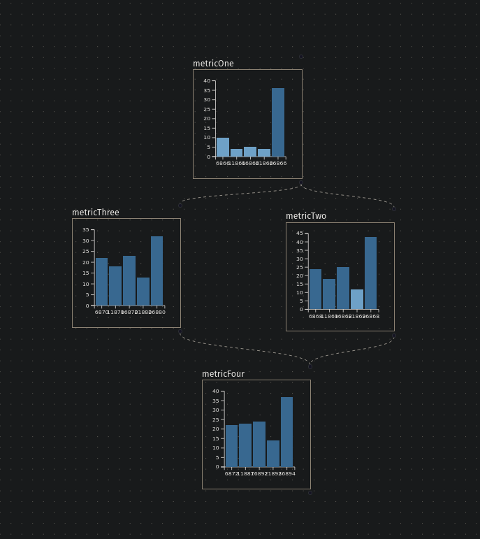

# Problem Statement

Web3 and AI are buzzwords that, while not entirely new, still generate misconceptions among the wider audience about their true value. There are numerous challenges to be addressed, particularly in the realm of political transparency. Currently, politicians' promises are often untracked, interested parties remain unknown, and the impact of laws is rarely measured.

# Solution

AI can provide objectivity, free from human bias. Tim Berners-Lee's original vision for Web3 was a semantic network, whereas today's focus is more on blockchain. By combining AI, semantic networks for knowledge graphs, and blockchain, we aim to develop a community-based tool that eliminates data smog and enhances the transparency of political promises.

# Business Model

The business model comprises two main elements: a marketplace for bet indices, protocols, AI debater models, and an auction/bet session system. The community builds and shares tools in the marketplace, bookmakers create auctions and bet sessions from these elements, and bettors provide the capital.

# Traction and Milestones

Metrics are outlined in a metrics map, divided into various layers and types. Key terminal metrics, such as "transparency," are not directly actionable but are connected to actionable metrics. These metrics have expected charts, and the directed graph clarifies the correlation between different chart forms.

For example, the key terminal metric "transparency" is expected to gradually increase, though it cannot be directly influenced. Its growth is anticipated if the knowledge graph evolves. The community aids in the growth of the graph, making the "health of business flow" an actionable business metric. This level evaluates the overall flows that generate revenue, necessitating development, testing, infrastructure, and other input metrics. Each metric node has its goal chart, facilitating the tracking of plans and progress.

# Financial Projections

Bets are perpetual.

# Team

Anyone can contribute.

# Risks and Mitigations

1. Lack of interest: We will deploy finite automata agents (bots) to imitate user behavior and generate initial interest.
2. Disconnection between features and business flow: The existence of a metrics map evaluated by business flows ensures alignment and functionality.
3. Complexity: Services will be modular to manage complexity.
4. Domain and implementation complexity: Everything is schemed and designed, the knowledge base is graphed, use cases are described, and a development log will be maintained.

# Conclusion

The project is modular, with independently combinable and communicative features. For the general user, it offers objective debates. For those seeking profit, it provides opportunities to win. Politics enthusiasts can monetize their interests, and the platform allows for extensive testing and transactions.

# Appendices

## Appendix #1: Bet Indices

Creating a game for betting on politicians' activities requires a careful balance of understanding political dynamics, public perception, and measurable outcomes. Here's how politicians' work could be qualified for such a game:

1. **Policy Effectiveness**: Players can bet on the effectiveness of policies proposed or enacted by politicians. This could include:
    - Economic policies
    - Social reforms
    - Environmental initiatives
    
    Outcome measures might include economic indicators, public opinion polls, or environmental data.

2. **Political Maneuvering**: Players could bet on the political maneuvering of politicians, such as their ability to:
    - Pass legislation
    - Win elections
    - Navigate scandals
    
    This could involve predicting election outcomes, approval ratings, or the resolution of scandals.

3. **Campaign Promises vs. Reality**: Players could bet on whether politicians fulfill their campaign promises. This could involve tracking specific promises made during elections and assessing whether they are achieved within a certain timeframe.

4. **Public Perception**: Players could bet on the public perception of politicians, including their:
    - Likability
    - Trustworthiness
    - Effectiveness
    
    This could involve tracking public opinion polls, media coverage, or social media sentiment.

5. **International Relations**: Players could bet on politicians' handling of international relations, such as:
    - Diplomacy
    - Trade negotiations
    - Conflicts
    
    Outcome measures might include international agreements signed, trade balances, or conflict resolutions.

6. **Ethical Conduct**: Players could bet on politicians' ethical conduct, including their adherence to:
    - Laws
    - Transparency
    - Accountability
    
    This could involve tracking legal investigations, ethics violations, or public trust surveys.

7. **Long-Term Impact**: Players could bet on the long-term impact of politicians' actions on:
    - Society
    - Economy
    - Environment
    
    This could involve assessing trends over several years, such as economic growth, inequality, or environmental sustainability.

Each of these categories could have specific metrics or events that players can bet on, with odds determined by experts in politics, economics, and other relevant fields. The game could also incorporate real-time updates and analysis to keep players engaged and informed about the latest developments in politics.

## Appendix #2.1: onthology.

All major domain entities and relations on a one map.

## Appendix #2.2: sample (onthology) use case.

That is how bet business flow can look like.

1. Bookmaker buys bet index at marketplace.
2. Bookmaker buys bet protocols at marketplace.
3. Bookmaker proposess bet at marketplace.
4. The one who defends the selected subject (defender) replies.
5. The one who wants to attack the selected subject (attacker) replies.
6. The one who will harvest the data sources replies.
7. The one who will approve the datasource replies.
8. Betsession starts.
9. Defender asks proposer to bring some data.
10. Proposer proposes.
11. Approver filters,
12. Truth is not measured, just bettor votes with its own money for all observed activity.
13. Attacker asks proposer to bring some data.
14. Proposer proposes.
15. Approver filters,
16. Truth is not measured, just bettor votes with its own money for all observed activity.
17. Today defender won. It means its side collected mor trust equals money. So all funds goes to defender side and infra.

## Appendix #3: actor agent.

Actor is xstate state machine with self(and outer) control. Connected to playwright it can imitate both gui and api user behaviour.

## Appendix #4: camunda monitor.

Monitor has both chart and interactive tables to look for processes along its variables.

## Appendix #5: event tracer.

Helps to trace events through layers.

## Appendix #6.1: metrics map.

Helps to keep metrics connected and consistant, to avoid isolated feature-development.

## Appendix #6.2: metrics map node graph.

Implementation of a metrics map. Directed and layered.

## Appendix #7: grid graph calendar.

Presents development plan as a graph. By moving node horizontally role is assinged, by moving vertically date is assigned.
So one can ask another for task and result of one can be used by many. Hyper focus, hyper solidity.

